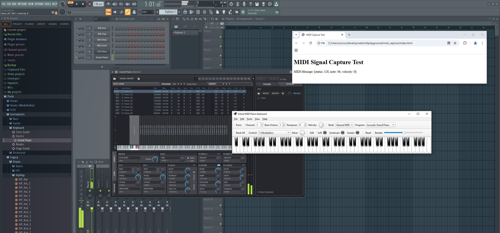

# webmidicapture
Messing with MIDI in the browser via the Web MIDI Api. A proof-of-concept that demonstrates how to capture MIDI events, like key presses on an e-piano or a MIDI controller attached to the computer, in the browser and react to them.


## MIDI event capturing test

This script assumes you have a MIDI device like a keyboard attached to a desktop or laptop computer (the client) and that a study participant is ready to play a song on that instrument. We want to display instructions for what to play in the web browser and record the MIDI events (key presses) of the song, so that we can analyze the performance.

Technically, we listen for MIDI events with the Web MIDI Javascript API in the browser, and send the collected data to our web server with low latency, using web sockets.

The source code for this is in the [./docs/midi_capture/](./docs/midi_capture/) directory.

If you do not have a physical MIDI instrument, see the instructions in the file [virtual_midi_instrument_setup.md](./virtual_midi_instrument_setup.md) to setup a software MIDI device.

When you have properly connected your hardware or software MIDI controller, the Web MIDI API, which is integrated into all major browsers by now, can pick up the MIDI signals and make them available to your Javascript code (users need to allow MIDI access, like for the camera and mic during video chats). For now we simply display the MIDI events on key presses:



One could easily generate sounds from the MIDI event via a Javascript software synthesizer, like the Sample in Tone.js.

### Client / Server fun

This repo now also contains a websocket server based on Python/Flask. If you click the button labeled `'Activate sending data to server'`, the browser will send the MIDI data to the backend server, and the server will reply to confirm that it received the data. The server response is displayed in the browser. Timestamps are included so you get a rough impression of latency.

To start the server, install `flask_socketio` via pip, then run `python flask_websocket_server.py` in the server directory. More slowly:

```shell
git clone https://github.com/dfsp-spirit/webmidiplayground.git webmidiplayground
cd ./webmidiplayground/docs/midi_capture/server
python -m venv myvenv
source myvenv/bin/activate
pip install flask_socketio
python flask_websocket_server.py
```

If you do not want the server, you can simply ignore it.

Now open the client in your browser and play some piano.


## Developer information

### A note on browser support

Recent versions of Firefox, Chrome, Edge and Opera support the Web MIDI Api (see [caniuse.com](https://caniuse.com/midi)).

#### Local development and testing

When testing locally, I noticed that the situation in Firefox (FF) is a bit more complicated though: while FF has had Web MIDI support for quite a while according to [caniuse](https://caniuse.com/midi), at least locally via `file://` URLs (simply double-clicking your HTML file), it did not work for me in Firefox 135, the latest version as of 2/9/2025. This may be intentional because according to the [FF documentation on the Web MIDI Api](https://developer.mozilla.org/en-US/docs/Web/API/Web_MIDI_API), usage of the API is only supported in *secure contexts* (e.g., `https://`).

So I tried serving the directory via python's built-in web server and it worked. There is no need for an SSL certificate: as long as it is on localhost, `http://` is considered a secure context. So try ```python -m http.server 8000``` in the directory with the HTML/JS file and connect to `http://localhost:8000`.

If you do not feel like spinning up a local web server and want to simply test locally via `file://` instead, I would recommend to simply use Chrome instead of Firefox.

#### Deployment requires SSL for Firefox users

Keep in mind that the Firefox limitation or security measure mentioned in the last paragraph also means that if you finally deploy your app for remote users, an SSL certificate/HTTPS is **required** on your web server for it to work under Firefox because on a remote machine, `http://` URLs are of course *not* considered a secure context.


## Testing the client online

You can try the client on [github pages here](https://dfsp-spirit.github.io/webmidiplayground).

