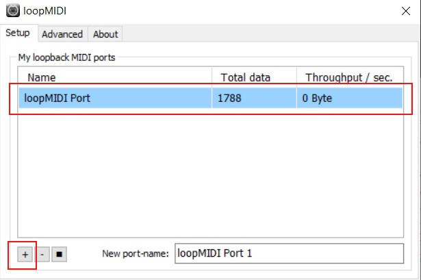
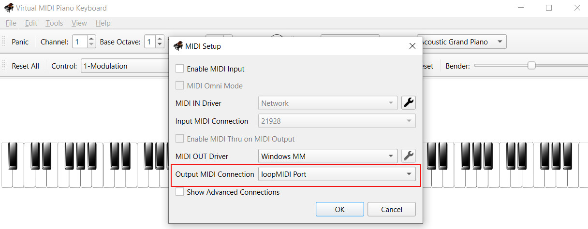

# webmidiplayground
Messing with MIDI in the browser via the Web MIDI Api. A proof-of-concept.


## A note on browser support

Recent versions of Firefox, Chrome, Edge and Opera support the Web MIDI Api (see [caniuse](https://caniuse.com/midi)).

### Local development and testing

When testing locally, I noticed that the situation in Firefox (FF) is a bit more complicated though: while FF has had Web MIDI support for quite a while according to [caniuse](https://caniuse.com/midi), at least locally via `file://` URLs (simply double-clicking your HTML file), it did not work for me in Firefox 135, the latest version as of 2/9/2025. This may be intentional because according to the [FF documentation on the Web MIDI Api](https://developer.mozilla.org/en-US/docs/Web/API/Web_MIDI_API), usage of the API is only supported in *secure contexts* (e.g., `https://`).

So I tried serving the directory via python's built-in web server and it worked. There is no need for an SSL certificate: as long as it is on localhost, `http://` is considered a secure context. So try ```python -m http.server 8000``` in the directory with the HTML/JS file and connect to `http://localhost:8000`.

If you do not feel like spinning up a local web server and want to simply test locally via `file://` instead, I would recommend to simply use Chrome instead of Firefox.

### Deployment requires SSL for Firefox users

Keep in mind that the Firefox limitation or security measure mentioned in the last paragraph also means that if you finally deploy your app for remote users, an SSL certificate/HTTPS is **required** on your web server for it to work under Firefox because on a remote machine, `http://` URLs are of course *not* considered a secure context.


## Some tests


### MIDI event capturing test

See [./midi_capture/ directory](./midi_capture/).

You can use a hardware MIDI generator like a keyboard, but for testing purposes a virtual MIDI keyboard like [VMPK](https://vmpk.sourceforge.io/) will do just as fine.

I have its output attached to [loopMIDI](https://www.tobias-erichsen.de/software/loopmidi.html), and from there into FL Studio to synthesize sounds from the MIDI signals, but the FL Studio part is entirely optional of course. We are only interested in the raw MIDI signals here, so if you're fine with using the default software sythesizer, you do not need a separate DAW.

If you do not have a physical MIDI instrument, you will need loopMIDI though. Make sure to start it, create a port (simply click the `Add Port` button labeled `+` on the Setup tab once) and make sure to keep the software running. Running it minified is fine, but it needs to run and have a port configured:



 The in your virtual MIDI controller like VMPK, configure MIDI routing and set the port you created in loopMIDI as the MIDI output:

 

The Web MIDI API, which is integrated in recent Chrome versions and other browsers, can then pick up the MIDI signals and make them available to your Javascript code (users need to allow MIDI access, like for the camera and mic). For now we simply display the MIDI events on key presses:


### Client / Server fun

This repo now also contains a websocket server based on Python/Flask. If `send_to_server` is set to `true` in webclient\midi.js, the browser will send the MIDI data to the backend server, and the server will reply to confirm that it received the data. The server response is displayed in the browser.

To start the server, install `flask_socketio` via pip, then run `python flask_websocket_server.py` in the server directory.

Now open the client in your browser and play some piano.

