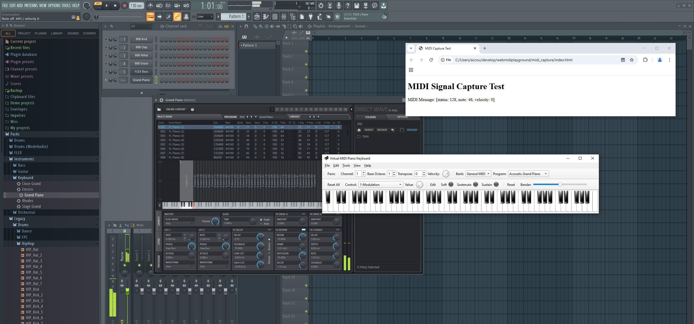

# webmidiplayground
Messing with MIDI in the browser via the Web MIDI Api.

## A note on browser support

Note that while recent versions of Chrome, Edge and Opera support the Web MIDI Api. In Firefox it seems more complicated: while it has had support for quite a while according to [caniuse](https://caniuse.com/midi), at least locally via file:// URLs, it does not seem to work for me in Firefox 135, the latest version as of 2/9/2025. This may be intentional because according to the FF documentation, usage of the API is only supported in secure contexts (https://).

## Some tests

### MIDI event capturing test

See [./midi_capture/ directory](./midi_capture/).

You can use a hardware MIDI generator like a keyboard, but for testing purposes a virtual MIDI keyboard like [VPMK](https://vmpk.sourceforge.io/) will do just as fine.

I have its output attached to [loopMIDI](https://www.tobias-erichsen.de/software/loopmidi.html), and from there into FL Studio to synthesize sounds from the MIDI signals, but that is entirely optional. We are only interested in the raw MIDI signals here, so if you're fine with not hearing anything or using the default Windows software sythesizer, you do not need this.

The Web MIDI API, which is integrated in recent Chrome versions and other browsers, can then pick up the MIDI signals and make them available to your Javascript code. For now we simply display them on key presses:

