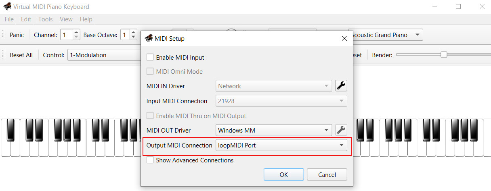

# Setup of a software MIDI keyboard

## Setup under Windows 10

If you do not have a physical MIDI keyboard, for testing purposes a virtual MIDI keyboard like [VMPK](https://vmpk.sourceforge.io/) will do just as fine.

You will also need a virtual MIDI cable to make your virtual device appear as a physical MIDI device on a MIDI port.We will use [loopMIDI](https://www.tobias-erichsen.de/software/loopmidi.html) for that purpose. Make sure to start it, create a port (simply click the `Add Port` button labeled `+` on the Setup tab once) and make sure to keep the software running. Running it minified is fine, but it needs to run and have a port configured:

 The in your virtual MIDI controller like VMPK, configure MIDI routing and set the port you created in loopMIDI as the MIDI output:

 

## Using a custom software sythesizer

The VMPK tool comes with its own software sythesizer to play sounds from the MIDI events, but you can of course use a custom software sythesizer if you prefer. To do this, make sure you have a everything configured as described above.

Then, start you custom sythesizer software (e.g., a DAW like FL Studio) and configure the MIDI connections in it. You need to attach the output of the loopMIDI port as the input to your DAW. This will allow you to use all the instruments available in your DAW.
